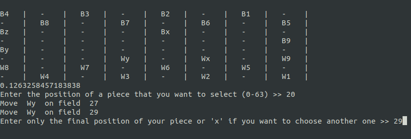

# checkers-bot
Very simple checkers bot made using minimax algorithm with alpha-beta pruning to calculate the ideal move.

This project features a very simple board game API that you can customize to support any other board game(just inherit the board class and override methods or change the code in the class itself). The Move class can be used to describe more complex moves such as mandatory moves, moves involving eating multiple pieces or complex movement.

The gameplay itself is easy. At the beginning a program will ask you about whether eating is considered mandatory, after that initial setup you will play first selecting a field containing your piece(white). The fields are enumerated 0 being the lower right and 63 being the upper left one(this implementation is a little bit frustrating in the CLI but it is good if you want to implement a GUI because mapping can be done in just a few lines of code). After that, all the possible moves wil be listed and you can select the position you want to move to or select another piece. The number underneath the table is the amount of time in which the program calculated his ideal move (the bot looks 5 moves ahead, you can play with this a little).

Enjoy :)
